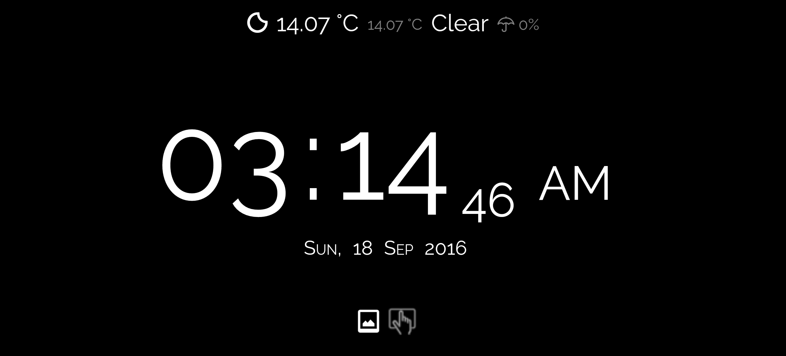

# tabletop-pi
Convert your Raspberry Pi (or any server) into a smart table clock.

## General Info 
TableTop Pi provides information at a glance. Just a glace at the screen will tell you the most vital information. 
- Time (duh..)
- Current Weather (Optional)
- Current Notifications (Optional) **(Android Only)** (Requires a companion app - Link will be added soon)

### Requirements
TableTop Pi requires a bare minimum of
- Raspberry Pi (Tested on Model 3, your mileage may vary) or any other web server.
  - Raspberry Pi should be connected to a network
- A screen to display the information

####Optional Items
- API Key from [Forecast.io](https://developer.forecast.io/). This is used to access weather information.
- Android Phone with BedSide Pi companion app (_link coming soon_)

## Setting Things Up 
**Note: This process assumes you have a Raspberry Pi 3. If you have some other model, or are using this on a web hosting, you might have to change a few things.**

####1. Setting up Pi as a web server
  1. Install Apache
    
    Install Apache using the following command:
  
        sudo apt-get install apache2 -y
      
  2. Test web server
  
      Open a browser on Pi and go to **http://localhost/**

  3. Install PHP
  
    Install PHP using the following command:
  
        sudo apt-get install php5 libapache2-mod-php5 -y
  
  4. Test PHP:
  
    Test PHP using the following command:
    
        php -version

**NOTE: For a more details on how to setup Pi as a web server, [go here](https://www.raspberrypi.org/documentation/remote-access/web-server/apache.md)**

Now that you Pi is successfully set up as a web server, we can go to the next step.

####2. Copy the repo files to your web server
  
  1. Download this project

    Either clone this project or download the entire project as a zip, your wish!
    
  2. Move the files to your web server
  
    Copy the downloaded / cloned files to the root your web server.
    For Raspberry Pi, the default location is **/var/www/html/**
