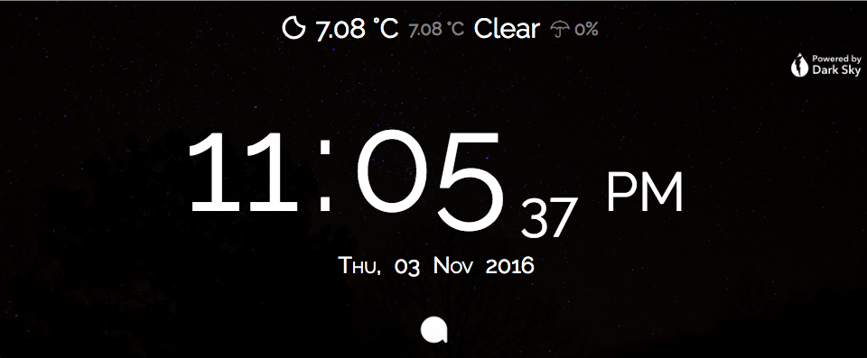

# BedSide Pi
Convert your Raspberry Pi (or any server) into a smart Bedside Clock.

** UPDATE: bedside-pi has been updated to use NodeJS with SocketsIO rather than Apache with long polling. However, you can still access the [Apache Version](https://github.com/avirakesh/bedside-pi/tree/master)**

## General Info 
BedSide Pi provides information at a glance. Just a glance at the screen will tell you the most vital information. 
- Time (Who would've thunk?)
- Current Weather (Optional)
- Current Notifications (Optional) **(Android Only)** (Requires [BedSide Pi Companion app](https://play.google.com/store/apps/details?id=com.highonh2o.tabletoppi))

### Requirements
BedSide Pi requires a bare minimum of
- Raspberry Pi (Tested on Model 3, your mileage may vary), or any other web server.
  - Raspberry Pi should be connected to a network
- A screen to display the information

####Optional Items
- API Key from [DarkSky](https://darksky.net/dev/). This is used to access weather information.
- Android Phone with [BedSide Pi companion app](https://play.google.com/store/apps/details?id=com.highonh2o.tabletoppi)

## Setting Things Up 
**Note: This process assumes you have a Raspberry Pi 3. If you have some other model, or are using this on a web hosting, you might have to change a few things.**

####1. Setting up Pi as a web server
  1. Install Apache:
    
    Install Apache using the following command:
  
        sudo apt-get install apache2 -y
      
  2. Test web server:
  
      Open a browser on Pi and go to **http://localhost/**

  3. Install PHP:

    Install PHP using the following command:
  
        sudo apt-get install php5 libapache2-mod-php5 -y
  
  4. Test PHP:
  
    Test PHP using the following command:
    
        php -version

**NOTE: For a more details on how to setup Pi as a web server, [go here](https://www.raspberrypi.org/documentation/remote-access/web-server/apache.md)**

Now that you Pi is successfully set up as a web server, we can go to the next step.

####2. Setting up BedSide Pi
  
  1. Download this project:

    Either clone this project or download the entire project as a zip, your wish!
    
  2. Move the files to your web server:
  
    Copy the downloaded/cloned files to the root your web server.
    For Raspberry Pi, the default location is **/var/www/html/**

  3. Test the web server:
  
    Go to http://localhost/ on a broswer in your Pi. You should see the clock working and the weather set to their default values.

  4. If you want notification mirroring, ensure that PHP scripts have write permission:

####3. Setting up weather (or removing it)

  * Setting up weather:
    1. Grab the API key from [darksky.net/dev](https://darksky.net/dev/)
    2. Open [get-weather.php](get-weather.php) on your web server
    3. Copy the API key from [darksky.net/dev](https://darksky.net/dev/) to **$apiKey**
    4. Set **$latlng** to your latitude and longitude
    5. (Optional) Open [js/script.js](js/script.js) on your web server and set the refresh interval
    
  * Removing weather:
    1. Open [index.html](index.html) on your web server
    2. Comment out the div which contains weather information
    3. Open [js/script.js](js/script.js) on your web server
    4. Follow the comments at line 54
    

####4. Setting up Notification Mirroring (or removing it)

  * Setting up Notification Mirroring:

    BedSide Pi is capable of mirroring notifications from your Android device. 
  
    1. Dowload [BedSide Pi Companion app](https://play.google.com/store/apps/details?id=com.highonh2o.tabletoppi) from Google Play Store 
    2. Open the app, and allow notification acccess
    3. Set up URL:
      1. Fill in the URL of your web server. 
    
        Use **ifconfig** to get the IP Address of your Pi.
        
        Note: Make sure the URL is preceded by http:// or https://
        
      2. Use **TEST CONNECTION** to check if your phone could talk to the web server
      3. If the connection was successful, press **UPDATE** to set the URL.
      
    4. Setup mirroring over WiFi:
    
      Unless you are running a web server with a static IP address, it is recommended to restrict notification mirroring to WiFi only.
      
      1. Turn on 'Mirror over WiFi only', if not already checked.
      2. (Optional - but recommended) Set WiFi SSID to mirror the notification over. Setting this will mirror notification only if the phone is connected to the specified WiFi. Press **UPDATE** once the SSID is set. Please note the whitespaces of SSID.
      
    5. Once everything is set, and URL connection is successful, tap **Send Test Notification** to see if notification mirroring works. 
    
      If it doesn't, make sure that the app has notification access and connection to server was successful.
      
    **NOTE: Notification Mirroring uses long polling to mirrror notifications, i.e. front-end sends a request to the backend every 2 seconds to sync up new notifications. This is fine with Pi, but may cause problems with other web servers.**
      
  * Removing Notification Mirroring:
    
    1. Open [js/script.js](js/script.js) on your web server
    2. Go to line 67 and follow the directions in the comments.

####And that is it, enjoy your BedSide Pi!!

## License

"THE BEER-WARE LICENSE" (Revision 42):

AvichalRakesh  wrote this project. As long as you retain this notice you can do whatever you want with this stuff. If we meet some day, and you think this stuff is worth it, you can buy me a beer in return. Avichal Rakesh
