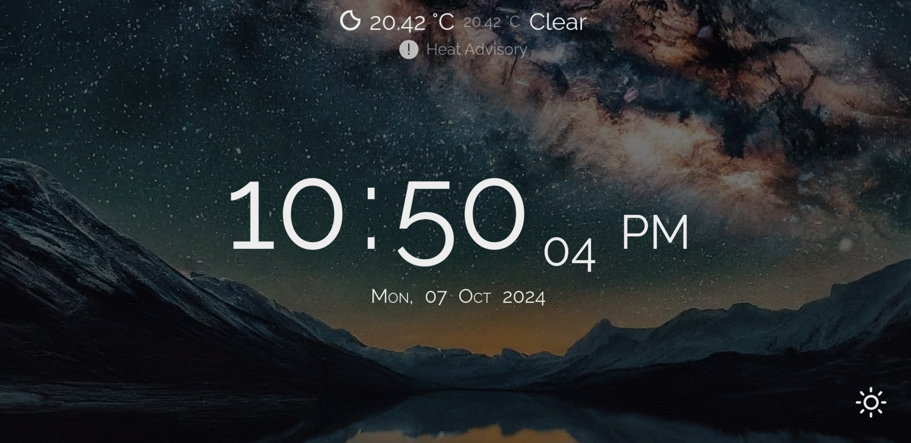

# BedSide Pi

Convert your Raspberry Pi into a smart Bedside Clock.



**UPDATE: I no longer have the patience for JavaScript, so moving the implementation
over to python, which should hopefully have better long term maintainability than
Node.js did.** _(Famous last words)_

~~**UPDATE: bedside-pi has been updated to use [Node.js](https://nodejs.org/en/) with
[Socket.io](http://socket.io/) rather than Apache with long polling. However, you can still
access the [Apache Version](https://github.com/avirakesh/bedside-pi/tree/apache)**~~

## General Info

BedSide Pi provides information at a glance.

-   Time (Who would've thunk?)
-   Current Weather (Optional)

### Requirements

BedSide Pi requires a bare minimum of

-   Raspberry Pi (Tested on RPi 3b and RPi 4b, your mileage may vary) running Raspbian.
-   A screen to display the information
    -   Technically, does not have to be the Raspberry PI. Any browser that can
        access the Raspberry Pi's IP will do..

#### Optional Items

-   API Key from [PirateWeather](https://pirateweather.net/)

## Setting Things Up

**Note: This process assumes you have a Raspberry Pi 4. If you have some other model, or are on a
different machine, you might have to change a few things.**

#### 1. Set up Python

1. Install Python

    Python comes built in with Raspbian distribution. Just make sure you have a reasonably new
    version of Python 3.

    Python version can be checked by running

    ```sh
    $ python --version
    ```

    For some dependencies (namely fastapi) you might need CPython symbols, which can be installed
    with

    ```sh
    $ sudo apt install python3.11-dev
    ```

    where `3.11` should be replaced with the specific version of python you have installed.

    For reference, these are the versions I have on my RPi 4b:

    ```sh
    $ python --version
    Python 3.11.2

    $ pip --version
    pip 23.0.1 from /home/pi/projects/bedside-pi/env/lib/python3.11/site-packages/pip (python 3.11)
    ```

2. Set up virtual environment (Optional, but recommended)

    It is generally recommended to have virtual environments for different Python projects.
    This allows various python projects to use their own dependency versions without interfering
    with each other.

    One no-frills virtual environment is `venv`, which can be installed using:

    ```sh
    $ sudo apt install python3.11-venv
    ```

    Once again, replace `3.11` with whatever python version you have installed
    on your system.

#### 2. Set up BedSide Pi

1. Download this project:

    Either clone repo using git CLI or download the entire project as a zip, your wish!

    For this example, I'll assume the project lives in `~/projects/bedside-pi`.

2. Create a virtual environment (Optional, but recommended):

    Use your favorite virtual environment tool to create a virtual environment
    for `bedside-pi`.

    If you chose `venv` from above, the virtual environment can be created as:

    ```sh
    $ cd ~/projects/bedside-pi
    $ python -m venv env # creates an env/ directory containing the virtual environment.
    ```

    This needs only be done once.

    Once the virtual environment is created, you can activate the environment by running:

    ```sh
    $ cd ~/projects/bedside-pi
    $ . env/bin/activate # activates the virtual environment for this terminal session only.
    ```

    This would need to be done for every new terminal session.

    You can check that your virtual environment is active by looking at the
    beginning of your terminal prompt, which will look something like this if
    it is activated:

    ```sh
    (env) user@hostname:~/projects/bedside-pi$
    ```

    Or, you can run `which python` and check if it points to your environment:

    ```sh
    pi@bedsidepi:~/projects/bedside-pi $ which python # environment NOT active
    /usr/bin/python # system Python

    pi@bedsidepi:~/projects/bedside-pi $ . env/bin/activate # activate environment

    (env) pi@bedsidepi:~/projects/bedside-pi $ which python  # environment active
    /home/pi/projects/bedside-pi/env/bin/python # environment Python
    ```

3. Install dependencies:

    With the virtual environment activated, you can now install the dependencies
    with:

    ```sh
    $ pip install -r requirements.txt
    ```

#### 3. Setting up weather (or removing it)

-   Setting up weather:

    1. Sign up and get an API key from [PirateWeather](https://pirateweather.net/)
    2. Open [`user_prefs.yaml`](user_prefs.yaml)
    3. Copy the API key from [PirateWeather](https://pirateweather.net/) to `apiKey`
    4. Update `latitude` and `longitude` with your location.
    5. (Optional) Set `refreshInterval` which is how frequently the weather will be updated
       (in minutes).
        - NOTE: It might seem obvious, but weather does not change very frequently, so there is
          little need to refresh it every other minute.

-   Removing weather:

    1. Open [`user_prefs.yaml`](user_prefs.yaml)
    2. Set `enabled` under `weatherPrefs` to `False`

#### 4. Running `bedside-pi`:

To run `bedside-pi`, use the following commands:

```sh
$ cd ~/projects/bedside-pi
$ . env/bin/activate # (optional) for venv users. Use whatever your virtual environment command is.
$ fastapi server.py
```

This will start the server on port `8000`.
You can now access the `bedside-pi` UI by navigating to `http://localhost:8000` in any web browser.

#### 5. (Optional) Running the script on boot

If you're like me you probably want to run `bedside-pi` automatically when your Raspberry Pi boots.
Thankfully that is easy enough to do with `crontab`.

1. First create a script to run `bedside-pi`, for example `~/run_bedside_pi.sh`.

    It could look something like:

    ```sh
    #!/bin/bash

    cd ${HOME}/projects/bedside-pi
    . ./env/bin/activate

    fastapi run server.py
    ```

    Make sure to give it execute permissions with `chmod +x ~/run_bedside_pi.sh`.

2. Add `crontab` entry to start `bedside-pi` on boot

    ```sh
    $ crontab -e
    ```

    This will open the crontab file in your default text editor.

    Add the following line:

    ```
    @reboot /home/pi/run_bedside_pi.sh >> /home/pi/bedside_pi.log
    ```

    This will run the script on boot and log output to `~/bedside_pi.log`.

3. (Optional) Run chrome in kiosk mode on boot:

    Add the following line to the crontab file:

    ```
    @reboot sleep 20 && chromium-browser --display=:0 --kiosk http://localhost:8000 >> /home/pi/chromium.log
    ```

    This will start Chromium in kiosk mode on boot, pointing to your local BedSide Pi instance.
    The `sleep 20` lets the bedside-pi script start before Chromium tries to connect.

4. Reboot the Raspberry Pi and wait for `bedside-pi` to start automatically!

#### And that is it, enjoy your BedSide Pi!!

## Using `bedside-pi`

There are a few options to customize `bedside-pi` in [`user_prefs.yaml`](user_prefs.yaml):

-   `use24HrClock`: Use 24-hour format instead of AM/PM.
-   `showSeconds`: Show seconds on the clock display.
-   `showLightsToggle`: Show button to toggle lights on/off.
-   `days`: List of days to be used. Change to whatever word/language you want displayed.
-   `months`: List of months to be used. Change to whatever word/language you want displayed.

Once `bedside-pi` is running, using it is simple: Use your eyeballs to look at it!

However, there are a few interaction in the UI:

1. Tapping the weather will fetch new data and update the display with
   latest weather information.
2. Tapping the lights toggle on the bottom right will toggle lights out mode,
   which dims the screen (while keeping the clock barely visible).
    - This will only show up if `showLightsToggle` is set to `True`.
    - Note that for most LCD monitors, this won't turn off the backlight, but
      it should significantly reduce the the light produced by the screen.

## License

"THE BEER-WARE LICENSE" (Revision 42):

Avichal Rakesh wrote this project. As long as you retain this notice you can do whatever you want
with this stuff. If we meet some day, and you think this stuff is worth it, you can buy me a beer
in return. Avichal Rakesh
